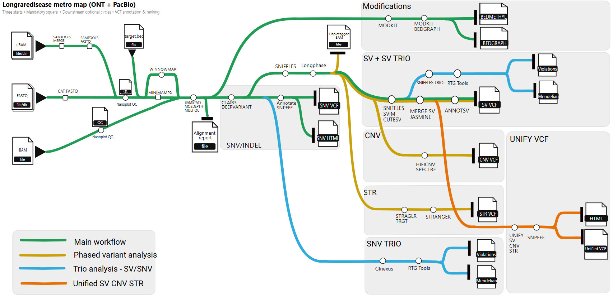

<h1>
  <picture>
    <source media="(prefers-color-scheme: dark)" srcset="docs/images/nf-core-longraredisease_logo_dark.png">
    
  </picture>
</h1>

[](https://github.com/codespaces/new/nf-core/longraredisease)
[](https://github.com/nf-core/longraredisease/actions/workflows/nf-test.yml)
[](https://github.com/nf-core/longraredisease/actions/workflows/linting.yml)[](https://nf-co.re/longraredisease/results)[](https://doi.org/10.5281/zenodo.20935122)
[](https://www.nf-test.com)

[](https://www.nextflow.io/)
[](https://github.com/nf-core/tools/releases/tag/3.5.1)
[](https://www.docker.com/)
[](https://sylabs.io/docs/)
[](https://cloud.seqera.io/launch?pipeline=https://github.com/nf-core/longraredisease)

[](https://nfcore.slack.com/channels/longraredisease)
[](https://twitter.com/nf_core)
[](https://mstdn.science/@nf_core)
[](https://www.youtube.com/c/nf-core)

## Introduction

**nf-core/longraredisease** is a specialized bioinformatics pipeline for **structural variant (SV) detection and clinical interpretation** from long-read sequencing data (Oxford Nanopore and PacBio). Designed for rare disease diagnostics, it delivers high-confidence variant discovery through multi-caller consensus, family-based analysis, and phenotype-driven prioritization.



The pipeline supports:

- **Multi-caller SV consensus** — Sniffles, CuteSV, SVIM with JASMINE merging
- **Phase-aware calling** — Haplotype-resolved SV detection using LongPhase
- **Family analysis** — Trio-based joint calling and de novo variant detection
- **Clinical annotation** — AnnotSV with disease database integration
- **Phenotype prioritization** — SVANNA-based ranking using HPO terms
- **Optional analyses** — SNVs (Clair3/DeepVariant), CNVs (Spectre/HiFiCNV), STRs (Straglr), Methylation (Modkit)

## Usage

> [!NOTE]
> If you are new to Nextflow and nf-core, please refer to [this page](https://nf-co.re/docs/usage/installation) on how to set-up Nextflow. Make sure to [test your setup](https://nf-co.re/docs/usage/introduction#how-to-run-a-pipeline) with `-profile test` before running the workflow on actual data.

First, prepare a samplesheet with your input data:

```csv title="samplesheet.csv"
sample,file_path,hpo_terms,sex,phenotype,family_id,maternal_id,paternal_id
sample1,/path/to/sample1.bam,HP:0002721;HP:0002110,1,2,,,
```

Now, you can run the pipeline using:

```bash
nextflow run nf-core/longraredisease \
    -profile <docker/singularity/.../institute> \
    --input samplesheet.csv \
    --outdir <OUTDIR> \
    --fasta reference.fasta \
    --sequencing_platform ont
```

> [!WARNING]
> Please provide pipeline parameters via the CLI or Nextflow `-params-file` option. Custom config files including those provided with the `-c` Nextflow option can be used to provide any configuration _**except for parameters**_; see [docs](https://nf-co.re/docs/usage/getting_started/configuration#custom-configuration-files).

For more details on pipeline usage and parameters, see [docs/usage.md](docs/usage.md).

## Pipeline output

To see the results of an example test run with a full size dataset refer to the [results](https://nf-co.re/longraredisease/results) tab on the nf-core website pipeline page.
For more details about the output files and reports, please refer to [docs/output.md](docs/output.md).

## Credits

I thank the following people for their contributions and guidance to the development of the pipeline:

The [nf-core](https://nf-co.re) team, and especially Friederike Hanssen, Ken Brewer, Nicolas Vannieuwkerke and Maxime U Garcia for their support and guidance in developing this pipeline.

I also thank the clinical scientists Chipo Mashayamombe-Wolfgarten, Hannah Titheradge, and Lorraine Hartles-Spencer for their invaluable clinical input and expertise. I would also like to thank Professor Andrew Beggs for his clinical guidance and expertise.

## Contributions and Support

If you would like to contribute to this pipeline, please see the [contributing guidelines](.github/CONTRIBUTING.md).

For further information or help, don't hesitate to get in touch on the [Slack `#longraredisease` channel](https://nfcore.slack.com/channels/longraredisease) (you can join with [this invite](https://nf-co.re/join/slack)).

## Citations

If you use nf-core/longraredisease for your analysis, please cite it using the following doi: [10.5281/zenodo.20935122](https://doi.org/10.5281/zenodo.20935122)

An extensive list of references for the tools used by the pipeline can be found in the [`CITATIONS.md`](CITATIONS.md) file.

You can cite the `nf-core` publication as follows:

> **The nf-core framework for community-curated bioinformatics pipelines.**
>
> Philip Ewels, Alexander Peltzer, Sven Fillinger, Harshil Patel, Johannes Alneberg, Andreas Wilm, Maxime Ulysse Garcia, Paolo Di Tommaso & Sven Nahnsen.
>
> _Nat Biotechnol._ 2020 Feb 13. doi: [10.1038/s41587-020-0439-x](https://dx.doi.org/10.1038/s41587-020-0439-x).
